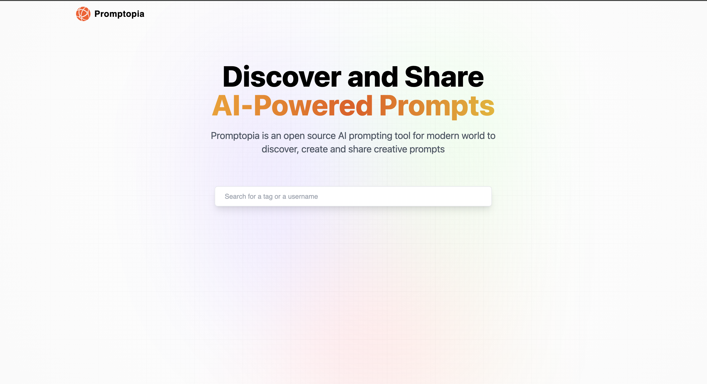

# Promptopia

A simple full-stack Next.js application to save and manage prompts for various AI tools. This project was built by following a [JavaScript Mastery tutorial on YouTube](https://www.youtube.com/c/JavaScriptMastery) focused on full-stack development concepts.

## Features

- Create, read, update, and delete AI prompts
- Backend API routes using Next.js API routes
- Data storage with MongoDB

## Screenshot



## Tech Stack

- **Frontend & Backend:** Next.js (React framework)
- **Database:** MongoDB (using Mongoose ODM)
- **API:** Next.js API Routes

## Getting Started

### Prerequisites

- Node.js (v14+ recommended)
- MongoDB database (Atlas or local)
- npm or yarn package manager

### Installation

1. Clone the repository:

   ```bash
   git clone https://github.com/yourusername/ai-prompts-manager.git
   cd ai-prompts-manager
   ```

2. Install dependencies:

   ```bash
   npm install
   # or
   yarn install
   ```

3. Create a .env.local file in the root directory and add your MongoDB connection string:

   ```bash
   MONGODB_URI=your_mongodb_connection_string_here
   ```

4. Run the development server:

   ```bash
   npm run dev
   # or
   yarn dev
   ```
